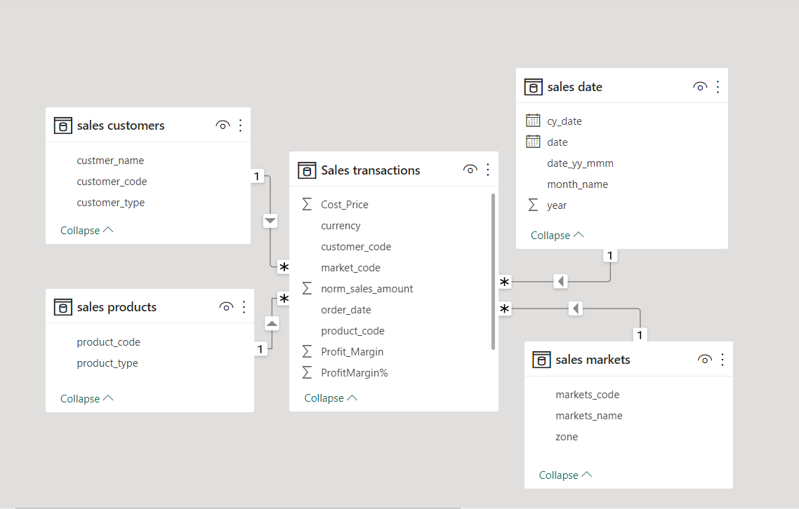
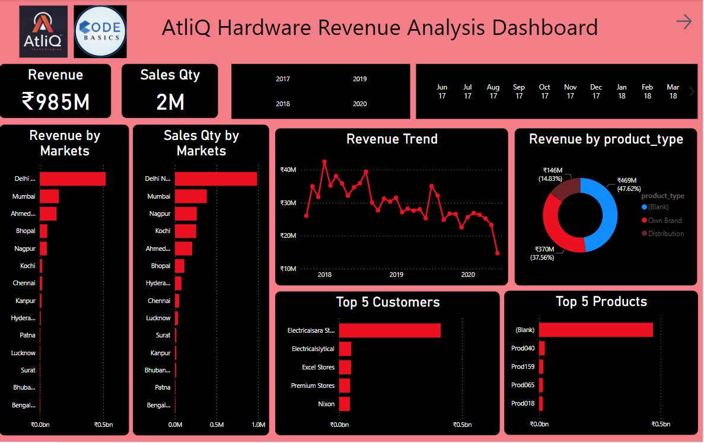
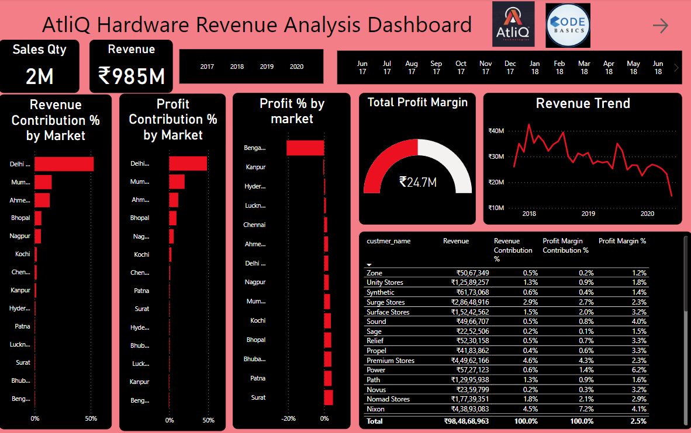
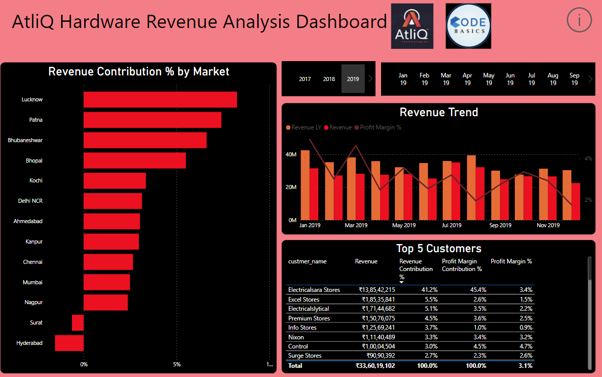

# AtliQ Sales Insights PowerBi Dashboard

# Problem statement
AtliQ hardware is a company which delivers computer hardware & peripheral Manufacturers to his clients, which has several branches throughout India. The sales director of the company is facing a lot of issues in terms of understanding how the business is performing and what are all the problem company is facing currently as the sales are not as expected and declining gradually. And whenever he calls the regional managers to get the current status of the sales and market, as a human behaviour, these people sugar cote the truth and send tons of Excel files instead of disclosing the truth, which made the sales director more frustrated. Humans are not comfortable in consuming numbers from excel files, which is obvious reason for the frustration.

# Solution
To effectively manage AtliQ hardware's profitability and revenue contributions, a robust data analytics solution is recommended. This system will calculate critical metrics including profit margin, profit margin percentage, total revenue, revenue contribution percentage, revenue last year (Ly), sales quantity, and total profit margin.

By analyzing these metrics, AtliQ can gain insights into the performance of different product lines, customer segments, and market trends. This data-driven approach allows for informed decision-making regarding pricing strategies, product focus, and resource allocation. With a comprehensive understanding of profit margins, revenue contributions, and historical trends, AtliQ can optimize its operations to maximize profitability, reduce costs, and make strategic decisions to achieve its financial goals.
# Data Model 

# Key Insights 

# Profit Analysis 

# Performance Analysis 

# Steps Followed in this project
Performed a High level analysis of data in SQL to get better understanding over the data.
Connected the SQL data set to PowerBI.
Performed ETL and data cleaning on the imported data.
In the currency there were two types of currencies in transactions, performed currency conversion to make all the currency type same
Created measure for needs and used them for creating visuals in PowerBi.
After the initial report reviewed by the stakeholders, made changes to the report based on the review commends.

